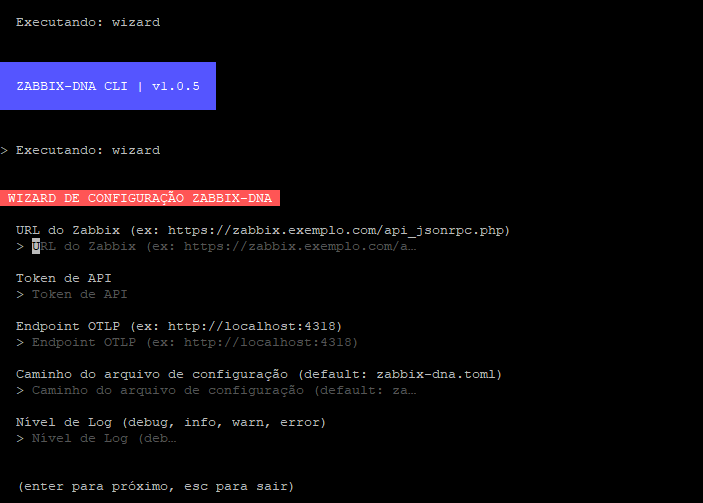

<div align="center">
  <h1 style="color: #D20000; background-color: #000000; padding: 15px; border: 2px solid #D20000; border-radius: 10px; display: inline-block;">Zabbix DNA | Enterprise Observability</h1>
  <p style="font-size: 1.2em; color: #D20000;">Performance. Observabilidade. Automação. Escalabilidade.</p>
  <p style="color: #D20000; font-style: italic;">"Redefinindo a interação com o Zabbix através de uma arquitetura nativa em Go de alta performance."</p>

  [](LICENSE)
  [](https://go.dev/)
  [](https://www.zabbix.com/)
  [](https://opentelemetry.io/)
</div>

---

## **ZABBIX-DNA**
O **ZABBIX-DNA** é o propósito central deste ecossistema: uma plataforma CLI de classe enterprise escrita 100% em Go, focada em performance extrema e observabilidade moderna.


### **Propósito Estratégico**
- **Performance Nativa**: Arquitetura em Go para processamento massivo de dados sem overhead.
- **Eliminação de Ruído**: Transformar milhares de itens em traces acionáveis via OTLP.
- **Conformidade Enterprise**: Automação de backups, migrações e auditoria.
- **Observabilidade First**: Integração nativa com o stack OpenTelemetry.

---



## **Guia de Início Rápido (Linux Only)**

### **Instalação Via Script**
```bash
curl -sSL https://raw.githubusercontent.com/rsdenck/zabbix-dna/main/dna.sh | bash
```

### **Compilação Manual**
```bash
go build -o zabbix-dna ./cmd/dna
sudo mv zabbix-dna /usr/local/bin/
```

---

## **Configuração**
O sistema utiliza o arquivo de configuração `zabbix-dna.toml`. 

### **Definições Estruturais (zabbix-dna.toml)**
```toml
[zabbix]
url = "https://zabbix.exemplo.com/api_jsonrpc.php"
token = "seu_token_aqui"
timeout = 30

[otlp]
endpoint = "http://otel-collector:4318"
protocol = "http"
service_name = "zabbix-dna"

[salt]
url = "tcp://127.0.0.1:4506"
user = "saltuser"
password = "password"
eauth = "pam"
```

---

## **Recursos & Comandos**

### **Observabilidade Avançada**
Exportação de métricas estruturadas:
```bash
zabbix-dna metrics --endpoint http://localhost:4318 --interval 60s
```

Mapeamento de eventos como traces OTLP:
```bash
zabbix-dna traces --endpoint http://localhost:4318 --batch-size 100
```

### **Administração de Recursos**
Listagem de hosts, templates e proxies:
```bash
zabbix-dna host list
zabbix-dna template list
zabbix-dna proxy list
```

### **Integração SaltStack**
Administração de Zabbix Proxies e infraestrutura via SaltStack:
```bash
zabbix-dna salt ping --target '*'
zabbix-dna salt run pkg.install --target 'proxy-01' zabbix-agent2
```

Execução de backups de configuração:
```bash
zabbix-dna backup
```

---

## **Filosofia**
- *"Se não é monitorado, não existe."*
- *"Se é repetitivo, deve ser automatizado."*
- *"Infra não é arte. É engenharia."*

---

## **Mantenedor**
**Ranlens Denck** é Analista de Infraestrutura de TI focado em segurança, automação e monitoramento. Sua missão é eliminar o trabalho manual e aumentar a previsibilidade através de uma observabilidade proativa.

<div align="center">
  <p style="color: #D20000; background-color: #000000; padding: 15px; border-top: 2px solid #D20000; border-radius: 0 0 10px 10px;">
    <b>Ranlens Denck | Observabilidade First</b><br>
    Construindo sistemas que não acordam pessoas de madrugada.<br>
    <a href="https://www.linkedin.com/in/ranlensdenck/" style="color: #D20000;">LinkedIn</a> |
    <a href="mailto:ranlens.denck@protonmail.com" style="color: #D20000;">Email</a>
  </p>
</div>
